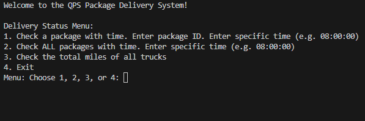

# QPS Delivery Service  🚚
A Python-based program designed to optimize delivery routes using the **nearest distance algorithm**. This program calculates the most efficient route for deliveries, reducing travel time and improving overall efficiency. Ideal for anyone looking to streamline the delivery process.

## Key Features
- **Route Optimization:** Automatically calculates the shortest and most efficient path for deliveries, minimizing overall distance or time.
- **Efficient Data Handling:** The program utilizes **hashtables** for fast storage and retrieval of delivery locations, enhancing the performance of the nearest distance algorithm.
- **Delivery Status Menu:** Allows users to check the status of packages and trucks in real-time:
  - Check package status at a specific time.
  - View the status of all packages at a given time.
  - See total miles traveled by all trucks.
  - Exit the program.

## Technologies
- Core Language: **Python 3.x**
- **Data Structure:** **Hashtables** for fast location lookup, improving algorithm efficiency.
- **Algorithm:** The **Nearest Distance Algorithm**, optimized for solving the Traveling Salesman Problem (TSP) or routing challenges.

## Installation
- Clone or Download the repository.
- Change into the QPS-Delivery-Service directory: `cd QPS-Delivery-Service`
- To run the project, execute the following command: `python main.py`

## Author
Jennifer Nguyen